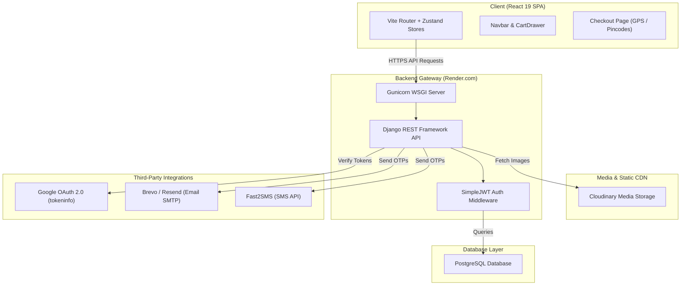

# 🔍 BLUSHH — Full System Architecture, Security, and Code Quality Audit

This document provides a comprehensive technical audit of the **BLUSHH (Janhavi Traders)** e-commerce application. It maps out the internal workings of the React frontend and Django REST backend, highlights recently fixed bugs, lists open security/performance gaps, and details code improvements.

---

## 🏗️ 1. System Architecture Map



---

## ⚙️ 2. Core Functional Flows (How it Works)

### A. Authentication & Verification Flow (OTP & Google Sign-In)
The system uses a passwordless OTP (Email/SMS) flow or third-party authentication:
1. **OTP Request:** The user submits their email or phone number.
   * Backend checks [OTPRateThrottle](file:///c:/Users/sahil/Desktop/janhavi%20traders/busy-maxwell/backend/users/views.py#L107-L115) (restricted to **3 requests per minute** to prevent financial abuse of APIs).
   * Generates a 6-digit random code and invalidates older OTPs for the user.
   * Sends the OTP in a background thread using Python's `threading.Thread` to prevent blocking the Gunicorn WSGI workers.
2. **OTP Verification:** The user submits the code.
   * The backend checks if the OTP exists, matches, is unused, and is under the expiry threshold (e.g., 10 minutes).
   * Generates simple JWT access tokens (7-day duration) and refresh tokens (30-day duration) via `django-rest-framework-simplejwt`.
3. **Google Sign-In:** The browser executes Google's GSI library, returning a credential ID token.
   * The backend contacts Google's public token validation API (`/tokeninfo`) to verify integrity.
   * Validates the token's audience claim (`aud`) against `GOOGLE_CLIENT_ID` to prevent client spoofing.
   * If valid, retrieves the user's name/picture and logs them in or registers them automatically.

### B. Cart & Order Placement Flow
1. **Shopping Cart:** Cart states are managed on the database server (`cart.models.Cart`, `CartItem`) to ensure cart persistence across devices.
2. **Checkout Constraints:** When placing an order at `orders/views.py`:
   * **Pincode Verification:** Verifies the user's shipping pincode matches the whitelisted delivery regions (`DELIVERY_PINCODES` in `base.py`).
   * **GPS Coordinates check:** If GPS coordinates are pinned, checks the Euclidean distance using the **Haversine formula**. If distance > 10km, blocks order placement.
   * **Stock Deduction:** Decrements product inventories.
   * **Cart Clearing:** Deletes cart items server-side and clears state on the client.

---

## 🪓 3. Bugs Fixed

* **[FIXED] Stock Decrement Race Condition:** Replaced standard memory-based decrement with atomic SQL database-level adjustments utilizing Django `F()` expressions. This prevents negative inventory levels during concurrent orders.
* **[FIXED] Deal of the Day Navigation Link:** Corrected route navigation to use the product `slug` rather than database `id` to prevent 404 router errors.
* **[FIXED] Production OTP Log Exposures:** Disabled printing verification codes to standard console outputs when Django's `DEBUG` is set to `False`.
* **[FIXED] API URL Configuration Typo:** Resolved a Vercel environmental settings typo pointing to `.online.com` instead of the correct API route.
* **[FIXED] Geofencing & GPS Inaccuracies:** Removed brittle Leaflet map coordinate requirements. Users are now validated by a Pincode whitelist. Optional coordinates bypass cached IP locations via `maximumAge: 0` for high accuracy.

---

## 🔒 4. Remaining Security Vulnerabilities

### SEC-1: Committed `.env` File in Repository (🔴 Critical)
* **File:** [.env](file:///c:/Users/sahil/Desktop/janhavi%20traders/busy-maxwell/backend/.env)
* **Issue:** Core database strings, API keys (Brevo, Fast2SMS), and Django secret keys are committed to Git history.
* **Remedy:** Add `.env` to `.gitignore` and delete it from git cache. Rotate all exposed credentials on Render immediately.

### SEC-2: Excessively Long JWT Access Token Lifespans (🟠 Medium)
* **File:** [base.py](file:///c:/Users/sahil/Desktop/janhavi%20traders/busy-maxwell/backend/janhavi_backend/settings/base.py)
* **Issue:** Access tokens are set to expire in 7 days. If an access token is intercepted, the attacker retains full account access for a week.
* **Remedy:** Reduce access token lifespan to 15–30 minutes, relying on refresh tokens (rotating) to generate new sessions.

### SEC-3: Lack of Admin Panel CSRF Protection (🟡 Low)
* **Issue:** API endpoints disable standard Django session CSRF checking in favor of stateless JWT validation. While secure for standard clients, it can leave admin pages vulnerable if session-cookies are used.
* **Remedy:** Ensure authorization tokens are passed strictly in the `Authorization` request header, never read from session cookies.

---

## ⚡ 5. Performance Bottlenecks & Fix Recipes

### PERF-1: N+1 Database Query in Category Serializer
* **File:** [serializers.py](file:///c:/Users/sahil/Desktop/janhavi%20traders/busy-maxwell/backend/products/serializers.py#L11-L17)
* **Issue:** Fetching category lists triggers a separate `COUNT` query for each category in the loop:
  ```python
  def get_product_count(self, obj):
      return obj.products.filter(is_active=True).count()
  ```
* **Fix:** Modify the Category view's queryset to annotate counts using SQL `Count` directly:
  ```python
  # In views.py
  from django.db.models import Count, Q
  queryset = Category.objects.annotate(
      product_count=Count('products', filter=Q(products__is_active=True))
  )
  ```

### PERF-2: N+1 Database Query in Order Shipments
* **File:** [serializers.py](file:///c:/Users/sahil/Desktop/janhavi%20traders/busy-maxwell/backend/orders/serializers.py)
* **Issue:** The Order serializer checks `obj.shipment` inside fields, causing a separate DB fetch per order.
* **Fix:** Use `select_related('shipment')` in the base queryset of `MyOrdersView` and `AdminOrderListView`.

---

## 💡 6. Code Quality Improvement Recommendations

### 1. Unique SKU Generator (Oracle Pattern)
* **File:** [models.py](file:///c:/Users/sahil/Desktop/janhavi%20traders/busy-maxwell/backend/products/models.py#L65)
* **Issue:** Autogenerated SKUs use `random.randint(10000, 99999)` with no uniqueness verification, exposing the app to database collision failures over time.
* **Fix:** Replace with an assertion loop to guarantee uniqueness:
  ```python
  def save(self, *args, **kwargs):
      if not self.sku:
          while True:
              sku = f'JT-{random.randint(10000, 99999)}'
              if not Product.objects.filter(sku=sku).exists():
                  self.sku = sku
                  break
      super().save(*args, **kwargs)
  ```

### 2. Synced Cart Clearing on Logout
* **File:** [cartStore.js](file:///c:/Users/sahil/Desktop/janhavi%20traders/busy-maxwell/frontend/src/store/cartStore.js)
* **Issue:** Clears local Zustand state, leaving database cart items intact when another user logs in on the same browser.
* **Fix:** Expose a method to clear the server cart via API:
  ```javascript
  clearCartServer: async () => {
    try {
      await api.delete('/cart/clear/');
      set({ cart: null });
    } catch (err) {
      console.error("Failed to sync cart clear", err);
    }
  }
  ```
